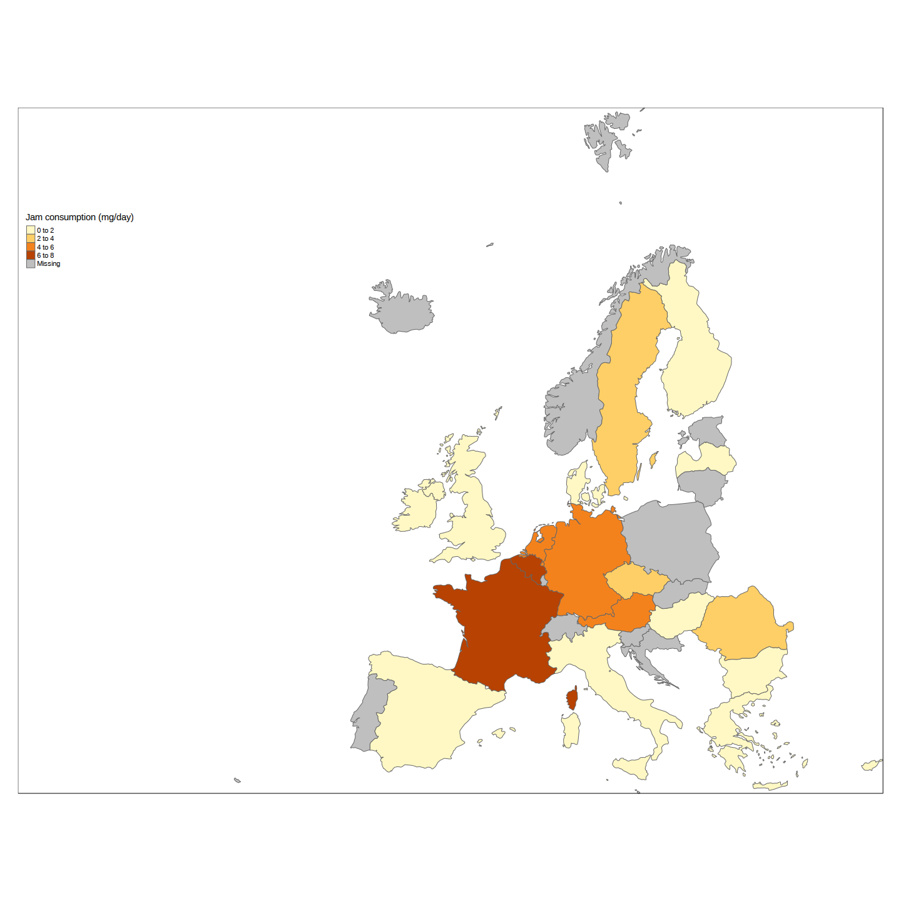
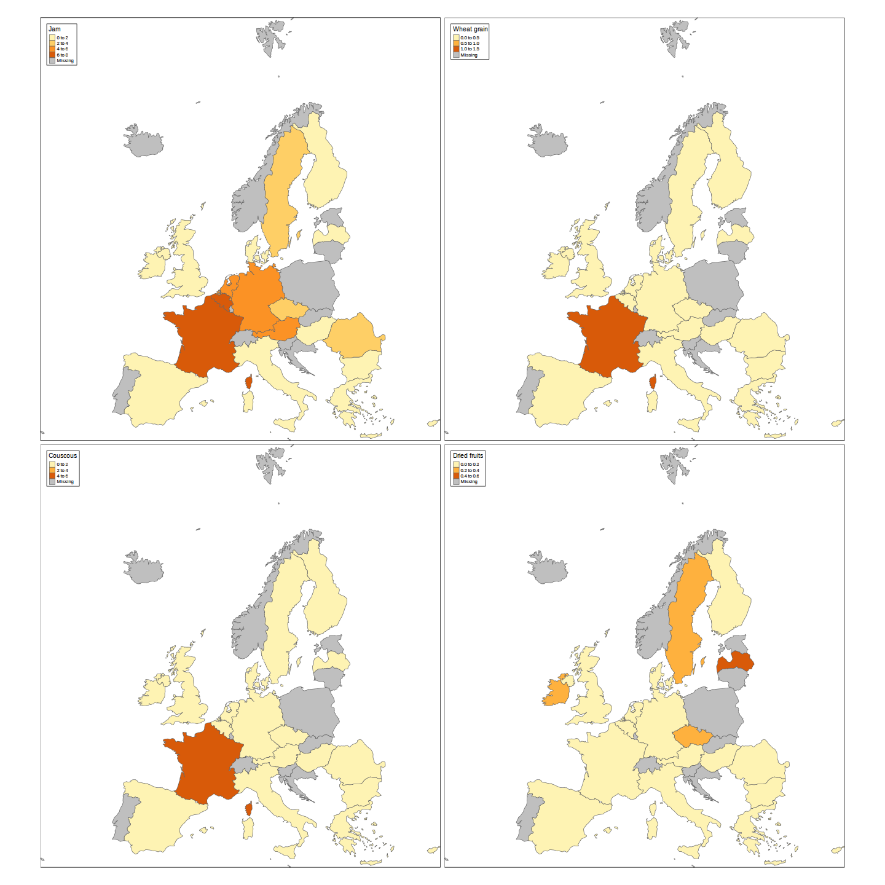
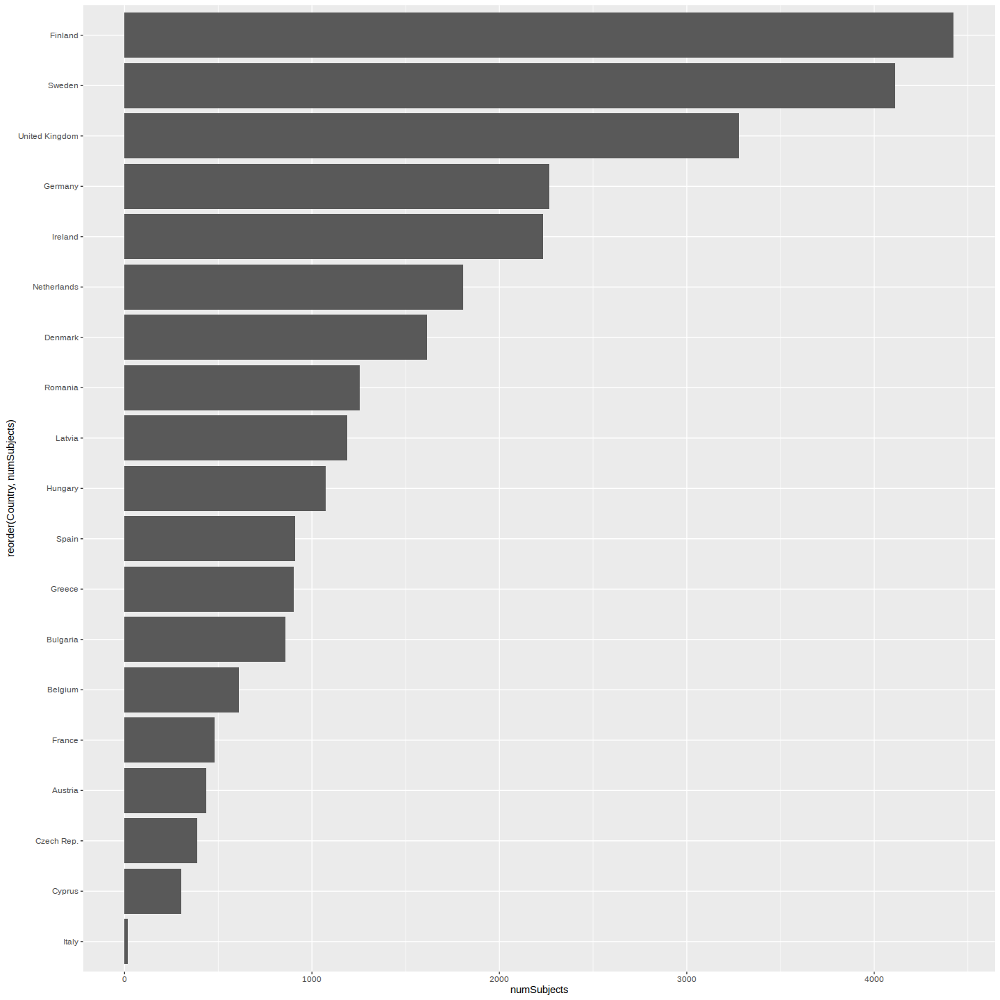
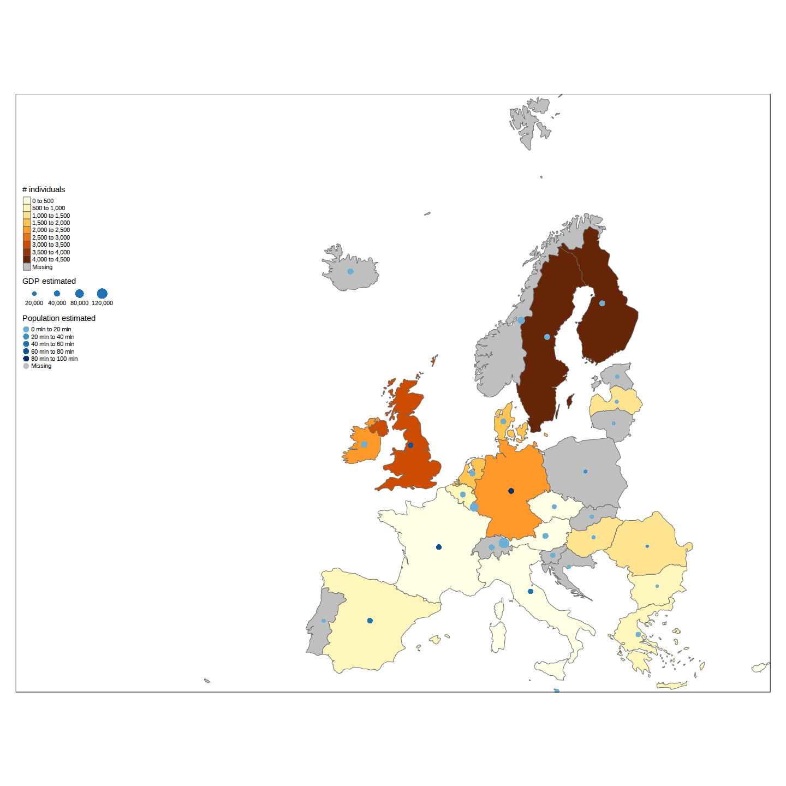
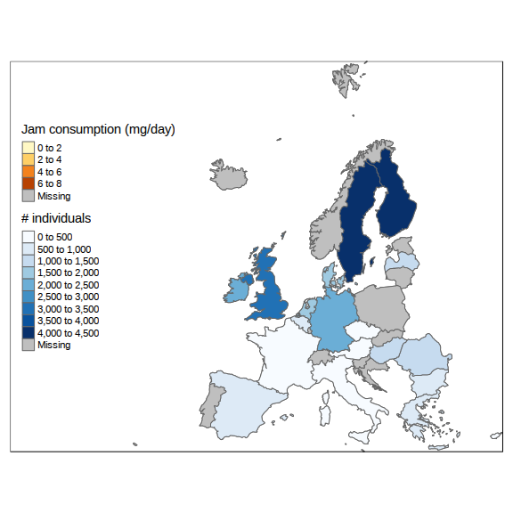

Mapping EFSA's food consumption data
================
Carsten Behring
July 08, 2016

EFSA Food consumption data
==========================

The European Food Safety Authority collects food consumption data from all EU countries and and integrates them in their database. The data is based on country specific surveys, in which individuals get interviewed about their food consumption habits. This data is used for EFSAs risk assesments as part of the exposure assesment.

Accessing the data
==================

The data is available from EFSA's website <http://www.efsa.europa.eu/en/food-consumption/comprehensive-database> in form of Excel files.

I selected for this tutorial the file of the "Chronic food consumption statistics" - "grams per day" - "all subjetcs".

The following code reads the data from the EFSA website and writes it to a local file. The file contains 4 sheets and we select the last one, which contains data on the lowest foodex level 4.

``` r
if (!file.exists("chronicgdaytotpop.xlsx"))
  download.file("http://www.efsa.europa.eu/sites/default/files/chronicgdaytotpop.xlsx","chronicgdaytotpop.xlsx")
```

``` r
data <- read_excel("./chronicgdaytotpop.xlsx","L4_All_subjects_g_day",skip=2) %>% 
  tbl_df() %>%
  mutate(Country=ifelse(Country=='Czech Republic','Czech Rep.',Country))
```

Description of data
===================

The data is organised 'per country', 'per survey','per population class' and 'per food group'. The food classification follows the Foodex standard developed by EFSA, which is a hierarchical system for classifying food. The current data set contains the most detailed levels (3 and 4)

The 'Mean' column contains then the mean consumption in grams per day of this food among the participants of the survey. Additionally to the mean other statistics about the distribution are given (standard deviation, percentiles)

We can interpret a single row, such as:

``` r
str(data %>% filter(`Foodex L4` == 'Couscous') %>% slice(1:1))
```

    ## Classes 'tbl_df', 'tbl' and 'data.frame':    1 obs. of  17 variables:
    ##  $ Country     : chr "Austria"
    ##  $ Survey      : chr "Austrian Study on Nutritional Status 2010-12 - Adults"
    ##  $ Pop Class   : chr "Adults"
    ##  $ Foodex L3   : chr "Wheat milling products"
    ##  $ Foodex L4   : chr "Couscous"
    ##  $ Metrics     : chr "A.01.000051"
    ##  $ Nr Subjects : num 308
    ##  $ Nr Consumers: num 7
    ##  $ Mean        : num 1.28
    ##  $ STD         : num 9.33
    ##  $ P5          : num 0
    ##  $ P10         : num 0
    ##  $ Median      : num 0
    ##  $ P95         : num 0
    ##  $ P97.5       : num 0
    ##  $ P99         : num 56
    ##  $ Comment     : num NA

in the following way.

There was a food consumption survey with name 'Austrian Study on Nutritional Status 2010-12 - Adults' run in 'Austria'. One group of '308' 'Adults' was surveyed and the 'Mean' food consumption of food 'Couscous' in that group was '1.28' g intake per day. There are some more variables for the distribution of the daily intake. Note the large standart deviation, which means that the eating habits of 'Couscous' various a lot.

Analysis of standart deviation
==============================

One interestiong question on this data is, which food are distributed evenly, so most individuals eat them in similar proportions. One potentail interpretation of those, is to say that these are the food which are 'eaten in all of Europe, in all ages'.

Lets find those with dplyr, like this:

``` r
data %>% group_by(`Foodex L4`) %>% 
  filter(Mean > 5) %>% 
  summarise(STD=mean(STD),mean=mean(Mean)) %>% 
  arrange(STD) %>% 
  head(20)
```

    ## # A tibble: 20 x 3
    ##                              Foodex L4      STD      mean
    ##                                  <chr>    <dbl>     <dbl>
    ## 1                        Salt, iodised 3.092543  6.313222
    ## 2                                 Salt 4.000443  8.159481
    ## 3                          Rice starch 5.130434  6.681824
    ## 4                             Fructose 5.279714  6.063511
    ## 5                  Oil,  frying, blend 6.041108  6.292762
    ## 6                         Cocoa powder 6.304501  6.495044
    ## 7                        Jelly candies 6.926092  5.243410
    ## 8       Margarine and similar products 7.385982  7.290324
    ## 9                       Cream 40 % fat 7.488790  6.402034
    ## 10 Parsley root (Petroselinum crispum) 7.644194 11.049928
    ## 11               Duck meat (Anas spp.) 7.887929  5.294000
    ## 12                      Tomato ketchup 7.911607  5.703227
    ## 13    Coffee beans, roasted and ground 8.036786  7.561675
    ## 14                      Cooked sausage 8.102821  5.397307
    ## 15         Cheese, Parmigiano Reggiano 8.367041  7.220518
    ## 16        Salad dressing, 25 - 50% oil 8.407296  5.696910
    ## 17                         Breadcrumbs 8.685303  6.797546
    ## 18   Spring onions, bulb (Allium cepa) 8.739136  5.635335
    ## 19               Plaice (Pleuronectes) 8.758317  5.157403
    ## 20     Jam, Raspberries (Rubus idaeus) 8.949646  8.119948

So it seems that the Europeans agrree on eating simmilar portions of :

-   salt
-   rice
-   fructose
-   Oil
-   Cream
-   tomato ketchup
-   coffee
-   cooked sausage

and others.

Prepare data for mapping
========================

For mapping purposes we can now decide which food group we want to use, 'Jam' in this case, and need to decide, how to aggregate the data of the different surveys and population groups. In this case I take the most simple approach, which is to average over all surveys and population groups.

This is good enough for illustrative purposes, but a exposure assessment based on this data needed to find a more sophisticated strategy in order to consider methodological differences between the studies.

``` r
jam <- data %>% filter(`Foodex L4`=='Jam') %>% 
  group_by(Country) %>% 
  summarise(food_mean=mean(Mean,na.rm = T))
```

The data is now in a format, ready to be presented in a pan european map, having a single value per country.

``` r
knitr::kable(jam)
```

| Country        |  food\_mean|
|:---------------|-----------:|
| Austria        |   5.2262848|
| Belgium        |   7.3638807|
| Bulgaria       |   0.0318451|
| Cyprus         |   0.9350935|
| Czech Rep.     |   3.6384642|
| Denmark        |   0.0000000|
| Finland        |   1.3505814|
| France         |   6.2648030|
| Germany        |   5.7111286|
| Greece         |   0.6074363|
| Hungary        |   0.0000000|
| Ireland        |   0.1185676|
| Italy          |   1.7422288|
| Latvia         |   1.7141950|
| Netherlands    |   4.5594901|
| Romania        |   3.9689273|
| Spain          |   0.4005222|
| Sweden         |   3.0928232|
| United Kingdom |   1.1951599|

For this tutorial we will use the tmap package. It comes already with a shape file of Europe. First we will restrict it to EU countries:

``` r
data(Europe)
Europe.eu <- Europe[!is.na(Europe$EU_Schengen),]
```

The tmap library allows to append this data easily to an existing European shape file, by using the 'append\_data' function.

As the spelling of 'Czech Republic' in the data does not match the shape file, we rename it here.

``` r
jam <- jam %>% 
  ungroup() %>%
  mutate(Country=ifelse(Country=='Czech Republic','Czech Rep.',Country))
Europe.jam <- append_data(Europe.eu,as.data.frame(jam),key.shp = 'name',key.data = "Country")
```

    ## Under coverage. No data for 13 out of 32 polygons: Switzerland, Estonia, Croatia, Iceland, Liechtenstein, ...

The 'key.shp' and 'key.data' parameter specify, on which columns the data and the shape file should be joined.

Showing a pan european map of food consumption
==============================================

simple map
----------

The data can now be shown on the screen as a simple map, containing one layer which represents the mean food consumption of jam in the color of the countries polygon.

``` r
tm_shape(Europe.jam) +
  tm_polygons(col='food_mean',title = "Jam consumption (mg/day)") +
  tm_format_Europe_wide()
```



more advanced map
-----------------

We can easily add extra information to the map, like the iso code of the countries, which are in column 'iso\_a3' of the shapefile.

``` r
tm_shape(Europe.jam) +
  tm_polygons(col='food_mean',title = "Jam consumption (mg/day)") +
  tm_text('iso_a3',size = .5,
          col = "black",
         bg.color = "white") +
    tm_format_Europe_wide()
```


multiple maps
-------------

The following code shows one of the strength of using tmap, which is the very easy creation of multiple maps. Let's see how to show 4 maps, each with a different food.

First we filter the data by the 4 foods, and then we transform it from 'long' to 'wide' format with the 'tidyr' packages.

``` r
food_data <- data %>% 
  
  filter(`Foodex L4` %in% c('Wheat grain','Jam','Couscous','Dried fruits')) %>% 
  group_by(Country,`Foodex L4`) %>% 
  summarise(food_mean=mean(Mean,na.rm = T))
  
food_data <- spread(food_data,"Foodex L4",'food_mean') 
```

This results in a table, which has one column per food:

``` r
knitr::kable(food_data)
```

| Country        |   Couscous|  Dried fruits|        Jam|  Wheat grain|
|:---------------|----------:|-------------:|----------:|------------:|
| Austria        |  0.2876738|     0.1139407|  5.2262848|    0.0000000|
| Belgium        |  0.5355902|     0.0032250|  7.3638807|    0.0000000|
| Bulgaria       |  0.0000000|     0.0000000|  0.0318451|    0.0826588|
| Cyprus         |  0.0000000|     0.0000000|  0.9350935|    0.0000000|
| Czech Rep.     |  0.0000000|     0.2356088|  3.6384642|    0.0000000|
| Denmark        |  0.0000000|     0.0000000|  0.0000000|    0.0001695|
| Finland        |  0.0303171|     0.0333622|  1.3505814|    0.0000000|
| France         |  4.6042196|     0.0000000|  6.2648030|    1.2603470|
| Germany        |  0.0124737|     0.1177921|  5.7111286|    0.0356976|
| Greece         |  0.0000000|     0.0000000|  0.6074363|    0.0000000|
| Hungary        |  0.0000000|     0.0000000|  0.0000000|    0.0000000|
| Ireland        |  0.1457767|     0.2361331|  0.1185676|    0.0000000|
| Italy          |  0.0589026|     0.0006176|  1.7422288|    0.0000000|
| Latvia         |  0.0000000|     0.5121008|  1.7141950|    0.0000000|
| Netherlands    |  0.0629168|     0.0725512|  4.5594901|    0.0069556|
| Romania        |  0.0355434|     0.0000000|  3.9689273|    0.0018987|
| Spain          |  0.0000000|     0.0129597|  0.4005222|    0.0000000|
| Sweden         |  0.2039704|     0.2110512|  3.0928232|    0.0230651|
| United Kingdom |  0.5319579|     0.1647893|  1.1951599|    0.0044839|

This can be converted into 4 maps, by just using a vector with the column names in the 'col' argument of tm\_polygons: This will create one map for each column name in the vector.

``` r
food_data <- food_data %>% 
  ungroup() %>%
  mutate(Country=ifelse(Country=='Czech Republic','Czech Rep.',Country))
Europe.4foods <- append_data(Europe.eu,as.data.frame(food_data),key.shp = 'name',key.data = "Country")
```

    ## Under coverage. No data for 13 out of 32 polygons: Switzerland, Estonia, Croatia, Iceland, Liechtenstein, ...

``` r
tm_shape(Europe.4foods) + 
  
  tm_polygons(col=c('Jam','Wheat grain','Couscous','Dried fruits'),n=3) +
  tm_format_Europe(legend.position = c("left","top"))
```



Map of people surveyed
======================

An other type of information which can be extracted from the data set, is information about the food consumption surveys. The following code counts the number of individuals, which were surveyed per country. In case of various surveys, I just sum it up.

``` r
peopleSurveyed <- data %>% 
  group_by(Survey) %>% 
  slice(1) %>% 
  select(Country,Survey,`Nr Subjects`) %>% 
  group_by(Country) %>% 
  summarise(numSubjects=sum(`Nr Subjects`))

kable(peopleSurveyed)
```

| Country        |  numSubjects|
|:---------------|------------:|
| Austria        |          436|
| Belgium        |          612|
| Bulgaria       |          859|
| Cyprus         |          303|
| Czech Rep.     |          389|
| Denmark        |         1614|
| Finland        |         4423|
| France         |          482|
| Germany        |         2266|
| Greece         |          903|
| Hungary        |         1074|
| Ireland        |         2232|
| Italy          |           16|
| Latvia         |         1189|
| Netherlands    |         1808|
| Romania        |         1254|
| Spain          |          912|
| Sweden         |         4113|
| United Kingdom |         3278|

This can be plotted as a bar chart, to compare easily the number of individuals surveyed. As we can see, there are large differences between them. Finland and Sweden have each surveyed more the 4000 individuals, while others have below 500.

``` r
ggplot(peopleSurveyed) +
  geom_bar(aes(x=reorder(Country,numSubjects),
               y=numSubjects), 
           stat = 'identity'
          ) + 
  coord_flip()
```



The same data shown as map shows a rather clear difference between north and southern Europe.

``` r
Europe.surveyed <- append_data(Europe.eu,peopleSurveyed,key.shp = 'name',key.data = "Country")
```

    ## Under coverage. No data for 13 out of 32 polygons: Switzerland, Estonia, Croatia, Iceland, Liechtenstein, ...

``` r
tm_shape(Europe.surveyed) +
  tm_polygons("numSubjects",n = 10,title = "# individuals") +
tm_shape(Europe.surveyed) +
  tm_bubbles(col = 'pop_est',
             size = "gdp_cap_est",
             title.col = 'Population estimated',
             title.size = "GDP estimated",
             palette = "Blues",
             contrast = c(0.5,1),
             n = 5) +
  tm_format_Europe_wide()
```



interactive map
===============

Tmap has as well an interactive mode. To demonstrate it, we will now add two layers we have used before,'Jam consumption' and '\# individuals surveyed' to the same interactive map.

In such a map the user can: \* change background (online) map \* zoom and drag the mp \* select layers to see (Jam consumption,\#individuals) \* click on countries to see all information for this country in the shape file

``` r
if (opts_knit$get()$rmarkdown.pandoc.to == 'html') {
  tmap_mode("view")
} else {
  tmap_mode("plot")
}  
```

    ## tmap mode set to plotting

``` r
tm_shape(Europe.jam) +
  tm_polygons(col='food_mean',title = "Jam consumption (mg/day)") +
tm_shape(Europe.surveyed) +
  tm_polygons("numSubjects",n = 10,title = "# individuals",palette="Blues") +
  tm_format_Europe_wide()
```



``` r
tmap_mode("plot")
```

    ## tmap mode set to plotting

session info
============

The following R library versions were used for this tutorial.

``` r
sessionInfo()
```

    ## R version 3.3.1 (2016-06-21)
    ## Platform: x86_64-pc-linux-gnu (64-bit)
    ## Running under: Ubuntu 14.04.4 LTS
    ## 
    ## locale:
    ##  [1] LC_CTYPE=en_US.UTF-8       LC_NUMERIC=C              
    ##  [3] LC_TIME=en_US.UTF-8        LC_COLLATE=en_US.UTF-8    
    ##  [5] LC_MONETARY=en_US.UTF-8    LC_MESSAGES=en_US.UTF-8   
    ##  [7] LC_PAPER=en_US.UTF-8       LC_NAME=C                 
    ##  [9] LC_ADDRESS=C               LC_TELEPHONE=C            
    ## [11] LC_MEASUREMENT=en_US.UTF-8 LC_IDENTIFICATION=C       
    ## 
    ## attached base packages:
    ## [1] stats     graphics  grDevices utils     datasets  methods   base     
    ## 
    ## other attached packages:
    ## [1] ggplot2_2.1.0 knitr_1.13    tidyr_0.5.1   tmap_1.4-1    dplyr_0.5.0  
    ## [6] readxl_0.1.1 
    ## 
    ## loaded via a namespace (and not attached):
    ##  [1] gtools_3.5.0       splines_3.3.1      lattice_0.20-33   
    ##  [4] colorspace_1.2-6   htmltools_0.3.5    yaml_2.1.13       
    ##  [7] XML_3.98-1.4       e1071_1.6-7        DBI_0.4-1         
    ## [10] sp_1.2-3           RColorBrewer_1.1-2 plyr_1.8.4        
    ## [13] stringr_1.0.0      rgeos_0.3-19       munsell_0.4.3     
    ## [16] gtable_0.2.0       raster_2.5-8       osmar_1.1-7       
    ## [19] htmlwidgets_0.6    coda_0.18-1        evaluate_0.9      
    ## [22] labeling_0.3       class_7.3-14       spdep_0.6-5       
    ## [25] highr_0.6          Rcpp_0.12.5        KernSmooth_2.23-15
    ## [28] geosphere_1.5-5    scales_0.4.0       classInt_0.1-23   
    ## [31] formatR_1.4        gdata_2.17.0       leaflet_1.0.1     
    ## [34] deldir_0.1-12      digest_0.6.9       stringi_1.1.1     
    ## [37] gmodels_2.16.2     grid_3.3.1         rgdal_1.1-10      
    ## [40] tools_3.3.1        bitops_1.0-6       LearnBayes_2.15   
    ## [43] magrittr_1.5       RCurl_1.95-4.8     lazyeval_0.2.0    
    ## [46] tibble_1.1         MASS_7.3-44        Matrix_1.2-6      
    ## [49] assertthat_0.1     rmarkdown_0.9.6.14 R6_2.1.2          
    ## [52] boot_1.3-17        nlme_3.1-128
